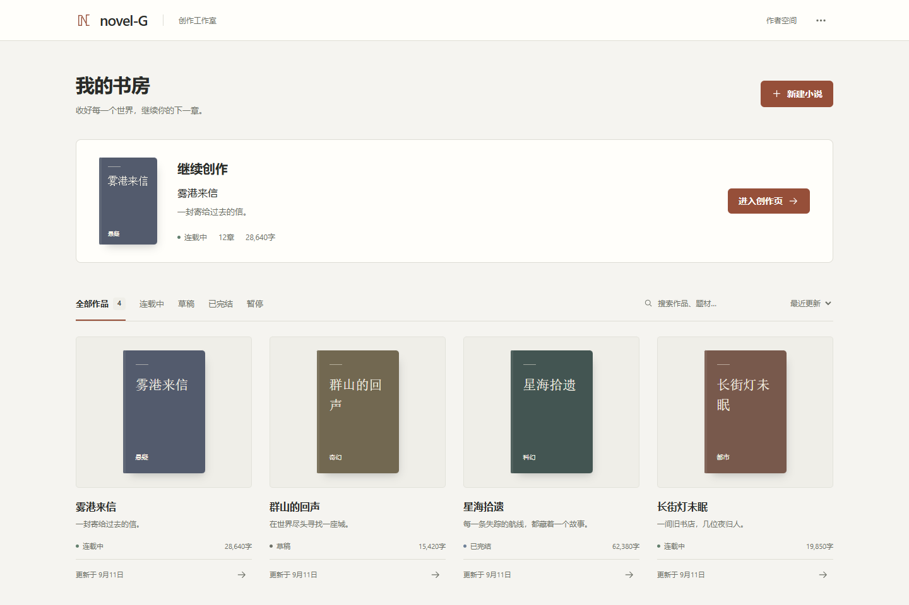
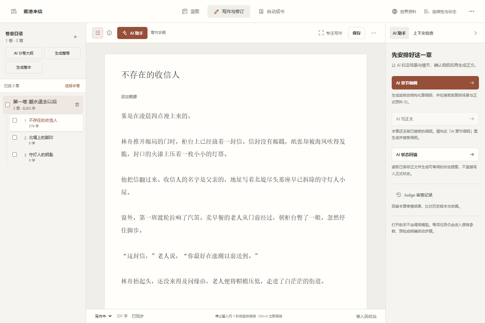
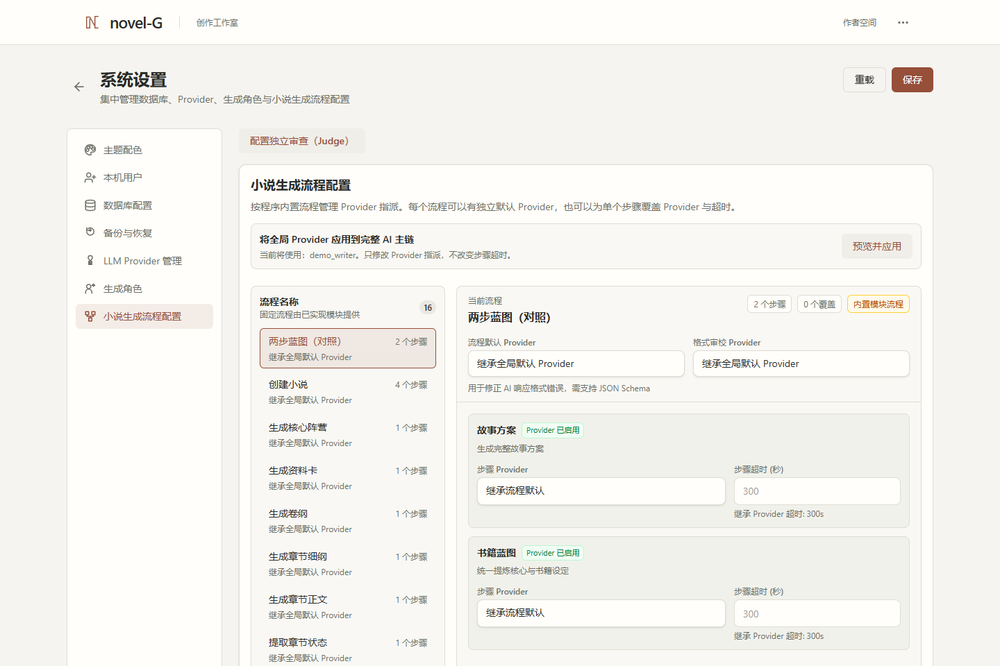

# Novel-G

[English](README.md) | 中文

**面向长篇小说的本地创作工作台。** 将故事构思、世界资料、卷章规划、正文写作和人物状态放在同一个工作空间中，支持手动创作、AI 辅助修订，以及由作者确认范围和预算的整卷、整本生成。

小说与资料保存在你配置的 MongoDB 中。手动写作无需模型 API Key；使用 AI 功能时，由你选择并配置模型提供商。

[功能概览](#功能概览) · [界面预览](#界面预览) · [快速开始](#快速开始) · [使用指南](docs/user-guide.zh-CN.md) · [排错指南](docs/troubleshooting.zh-CN.md) · [许可证与来源](#许可证与来源)

当前源码版本为 [0.1.0-rc.3](VERSION)，属于预发布版本。安装流程面向 Windows，本机与可信局域网使用方式见下文。

## 功能概览

| 功能 | 说明 |
| --- | --- |
| 写作与修订 | 管理书架、卷章、大纲和正文，支持自动保存、草稿恢复、字数统计及文本导出 |
| AI 辅助创作 | 从创意到故事方向、卷纲、章纲和正文，按需使用续写、场景改写、文风检查与卷级复盘 |
| 自动成书 | 按整卷或整本推进生成，查看章节进度、调用用量和暂停原因，处理问题后恢复任务 |
| 世界资料 | 管理人物、地点、物品、规则、世界设定、阵营和关系图，让创作设定集中可查 |
| 故事连续性 | 维护人物记忆、永久事实、伏笔与章节状态；故事健康检查提供无需模型调用的提示 |
| 酒馆卡互操作 | 导入 SillyTavern 角色卡 JSON、PNG 元数据和世界书，审核后用于已有小说或新书 |
| 插图与封面 | 通过兼容图像 API 或 ComfyUI 工作流生成封面、人物画像和场景插图 |

创作流程覆盖 **创意 → 故事方向 → 世界资料 → 卷纲 → 章纲 → 正文 → 状态回填**。你可以从空白开始，也可以使用 AI 创意或导入的角色卡建立故事。

## 界面预览

以下截图使用虚构小说内容与示例模型配置。

### 书架

浏览作品、查看创作进度，或直接回到正在写的章节。

### 章节编辑

在同一工作区中查看卷章目录、编辑正文，并使用 AI 助手。

### 工作流配置

为各个工作流步骤选择模型，调整生成参数。

## 快速开始

### 环境要求

| 依赖 | 要求 |
| --- | --- |
| 系统 | Windows 10/11 |
| Python | 64 位 3.11 或 3.12，安装时包含 Tcl/Tk 并加入 PATH |
| Node.js | 64 位 22.x（至少 22.13）或 24.x，包含 npm |
| MongoDB | 7/8，本机服务或可连接的远程实例 |
| 网络 | 首次安装需要下载依赖；AI 功能需要连接所配置的提供商 |

项目提供源码安装流程，Python、Node.js 和 MongoDB 需要自行安装。

### 安装与启动

1. 在[项目仓库](https://github.com/dzesen/novel-G)选择 **Code → Download ZIP** 下载源码，解压到可写目录，进入包含 `setup.bat` 和 `start.bat` 的文件夹。
2. 启动 MongoDB。默认连接为 `mongodb://localhost:27017`；使用其他地址时，先将 `backend/config/config_default.yaml` 复制为 `backend/config/config.yaml`，修改 `mongodb_url`。
3. 双击 `setup.bat`。脚本检查环境、安装依赖并构建前端。安装失败后，修正问题并重新运行即可复用已完成的步骤。
4. 双击 `start.bat`，在启动器中点击“全部启动”。前后端同时开始启动，均就绪后自动打开浏览器，首次进入时创建管理员账号。

默认访问地址为 [http://127.0.0.1:3000](http://127.0.0.1:3000)。日常使用只需运行 `start.bat`。详细安装与升级步骤见[源码安装指南](docs/source-release.zh-CN.md)。

### 创建第一本小说

1. 从书架新建小说，填写故事方向，或选择 AI 创意、酒馆卡导入。
2. 整理人物与世界资料，规划卷章结构，在章节工作区编写大纲和正文。
3. 需要自动生成时，先配置模型，再选择单章、整卷或整本任务，查看预检并确认本次调用范围与预算。

正文保存与状态回填分别进行。需要将本章变化用于后续创作时，再执行状态回填。管理员也可以在“设置 → 本机用户”中添加作者账号，每个账号有自己的书架。

## 模型配置与生成

管理员可在设置页配置 OpenAI 兼容接口、Gemini、Claude，以及各工作流使用的模型。封面和插图需另行配置兼容图像 API 或 ComfyUI 工作流。

页面浏览和就绪预检不发起付费模型调用。生成、审查和插图由作者显式启动；自动任务在确认的范围、调用次数和预算内执行，需要作者处理的问题会暂停显示。调用 AI 时，所需创作资料会发送给配置的提供商。

生成结果需要结合原文和设定审阅。可选择独立审查方式，查看生成记录与用量；截断或场景不完整的结果会保留为未完成草稿，供后续处理。不同模型的质量、速度和兼容性存在差异，具体边界见[使用范围与已知局限](docs/known-limitations.zh-CN.md)。

## 数据与备份

应用采用 **FastAPI + Next.js + MongoDB**，并提供 Windows 启动器。

| 数据 | 保存位置 |
| --- | --- |
| 小说、资料卡、状态与账号 | 配置的 MongoDB 数据库 |
| 模型密钥、数据库连接和运行设置 | `backend/config/config.yaml` |
| 图片与本地文件资产 | `managed-assets/`、`static/` |
| 数据库备份 | 默认 `backups/`，可在设置中调整 |
| 日志与检查结果 | `logs/`、`reports/` |

运行配置首次使用时从默认配置创建，已被 Git 忽略。不要将包含密钥的配置文件提交到仓库或附在问题反馈中。

管理员可在“设置 → 备份与恢复”管理数据库备份，章节编辑器可导出单章或整本小说文本。数据库备份不包含运行配置和本地图片，迁移时需另外保留这些文件。

升级前先停止生成任务、处理未确认用量并备份，再关闭前后端服务。将新版源码放入新目录，迁移配置与文件资产后运行 `setup.bat`。恢复数据库后需要重新登录，并重新授权后续生成。详见[升级与数据保留](docs/source-release.zh-CN.md#升级现有安装)。

## 日常维护

在项目目录的 PowerShell 中运行以下命令。

| 命令 | 用途 |
| --- | --- |
| `.\setup.bat --check` | 检查安装与 MongoDB，不下载依赖或重新构建 |
| `.\setup.bat --repair` | 关闭服务后重新安装依赖和构建，保留配置与本地数据 |
| `.\start.bat` | 打开启动器后手动选择模式并启动服务 |

检查会记录本地日志，首次配置检查可能创建默认配置。若依赖已就绪但 MongoDB 连接失败，启动数据库或修正连接后再执行 `--check`。安装日志位于 `logs/installation/`。

需要在同一可信局域网使用时，先停止服务，在启动器中启用“局域网模式（可信网络）”，再重新启动。公网托管部署尚未验收，部署范围见[安全说明](docs/security.zh-CN.md)。

## 文档与反馈

- [使用指南](docs/user-guide.zh-CN.md)
- [自动成书与暂停处理](docs/user-guide.zh-CN.md#自动成书)
- [安装、升级与数据保留](docs/source-release.zh-CN.md)
- [故障排查](docs/troubleshooting.zh-CN.md)
- [功能范围与已知局限](docs/known-limitations.zh-CN.md)
- [安全说明](docs/security.zh-CN.md)

问题与建议请通过 [GitHub Issues](https://github.com/dzesen/novel-G/issues) 提交，附上复现步骤、运行环境和脱敏后的错误信息。开发与提交约定见[贡献指南](docs/contributing.zh-CN.md)。

## 许可证与来源

Novel-G 采用 [GNU Affero General Public License v3.0](LICENSE)，SPDX 标识为 `AGPL-3.0-only`。

本项目基于 [YILING0013/AI_NovelGenerator](https://github.com/YILING0013/AI_NovelGenerator) 的 `dev` 分支开发，继承快照为 [9f8504f](https://github.com/YILING0013/AI_NovelGenerator/tree/9f8504f2833102bb65b1b7cf72c6a499fe989930)（2026-05-17）。感谢原项目作者及所有贡献者，保留原有署名、版权与提交归属。

项目来源记录及第三方材料说明见[许可证与来源](docs/license-status.zh-CN.md)和[上游与第三方声明](docs/third-party-notices.zh-CN.md)。
